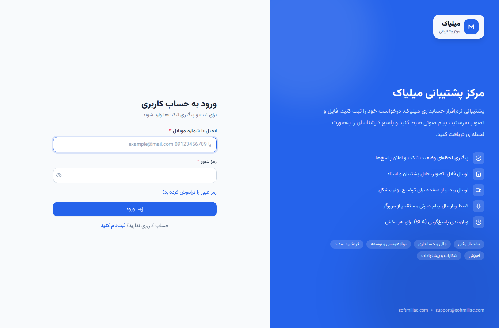
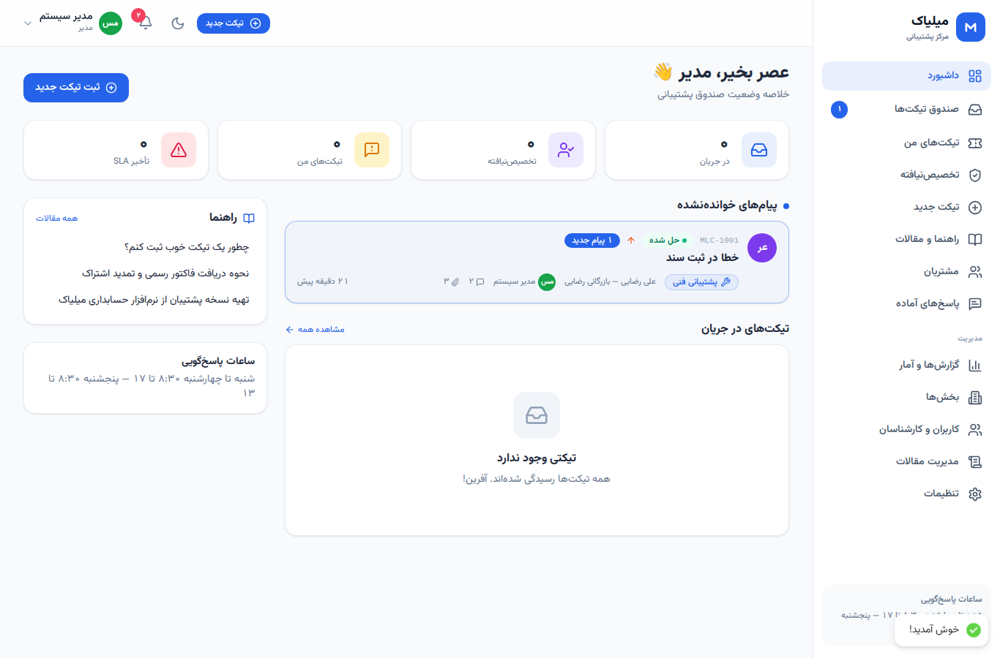
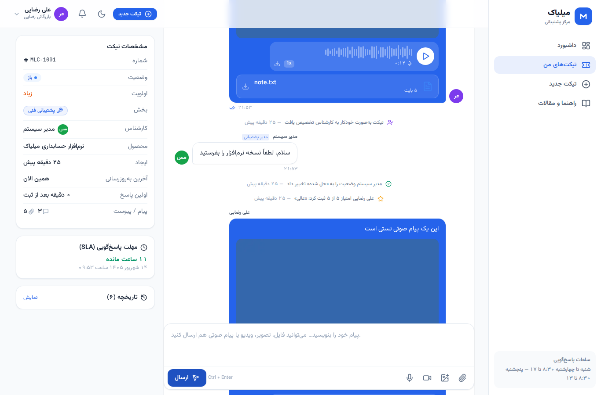
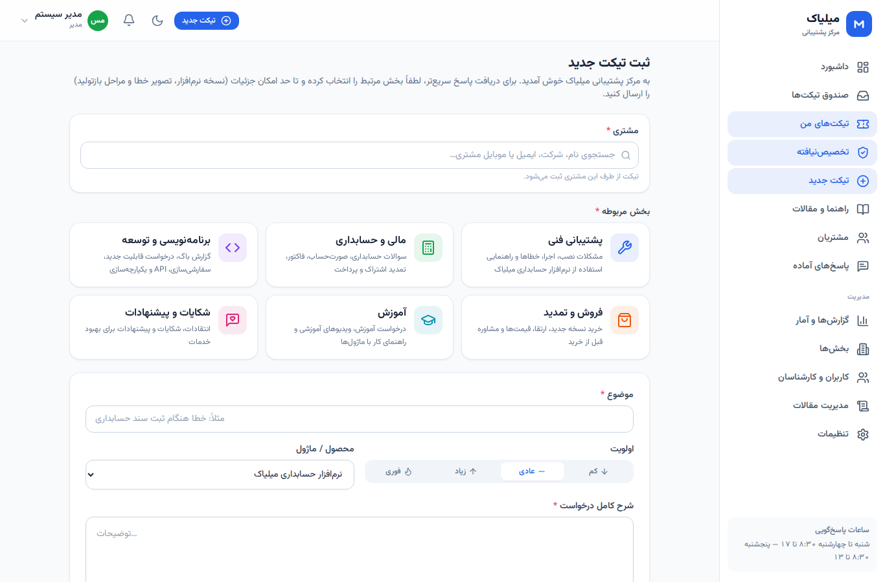
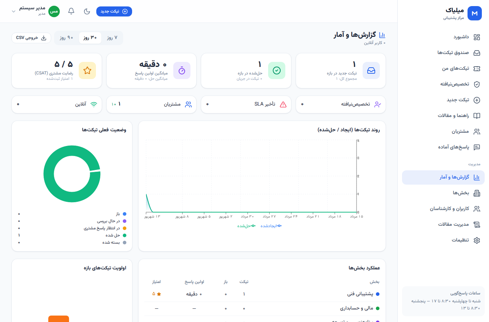
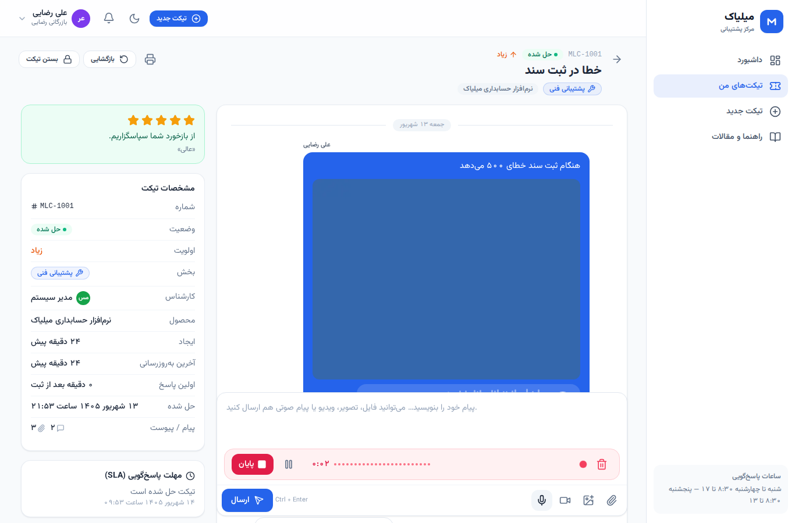
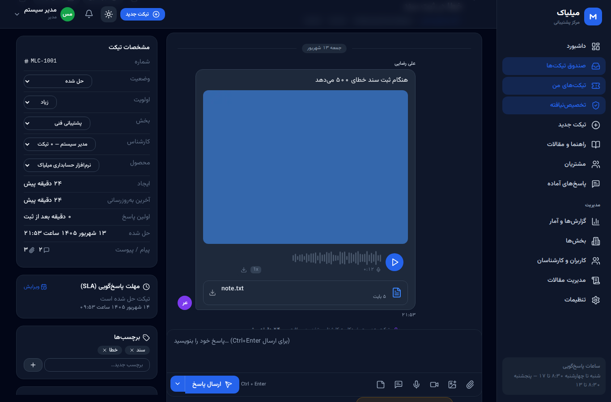
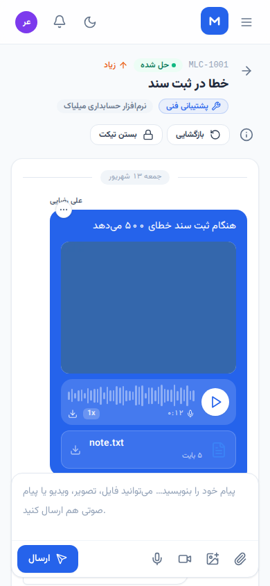

# مرکز پشتیبانی آنلاین میلیاک — سامانه تیکتینگ

سامانه تیکتینگ کامل، فارسی و راست‌چین برای **support.softmiliac.com** — مشتریان نرم‌افزار حسابداری میلیاک می‌توانند به بخش‌های مختلف (پشتیبانی فنی، مالی، برنامه‌نویسی، فروش، آموزش و …) پیام بدهند، فایل/تصویر/ویدیو بفرستند، **پیام صوتی ضبط و ارسال کنند** و پاسخ کارشناسان را به‌صورت لحظه‌ای دریافت کنند.

| ورود | داشبورد مدیر | گفتگوی تیکت |
|---|---|---|
|  |  |  |

| ثبت تیکت | گزارش‌ها | ضبط صدا | حالت تاریک | موبایل |
|---|---|---|---|---|
|  |  |  |  |  |

---

## امکانات

### برای مشتری
- ثبت‌نام/ورود با ایمیل یا شماره موبایل، بازیابی رمز عبور
- ثبت تیکت با انتخاب **بخش**، **اولویت** (کم/عادی/زیاد/فوری) و **محصول/ماژول**
- ارسال **فایل، تصویر، ویدیو، سند، نسخه پشتیبان** (drag & drop، Paste تصویر، انتخاب از دوربین موبایل)
- **ضبط پیام صوتی داخل مرورگر** (مکث/ادامه، پیش‌نمایش، نمایش سطح صدا) و پخش با کنترل سرعت
- گفتگوی چت‌مانند با تیک خوانده‌شدن، نشانگر «در حال نوشتن»، ویرایش/حذف پیام
- پیگیری وضعیت (باز، در حال بررسی، در انتظار پاسخ شما، حل شده، بسته شده)، بستن و بازگشایی تیکت
- **امتیازدهی ۱ تا ۵ ستاره** پس از حل مشکل + نظر
- اعلان درون‌برنامه‌ای، اعلان مرورگر، صدای اعلان، ایمیل و پیامک (اختیاری)
- پایگاه دانش (راهنما و مقالات) با پیشنهاد خودکار مقالات مرتبط هنگام ثبت تیکت
- پیش‌نویس خودکار پیام، حالت تاریک، کاملاً واکنش‌گرا (موبایل/تبلت/دسکتاپ)، تاریخ شمسی

### برای کارشناس
- صندوق تیکت‌ها با نماهای «همه / باز / خوانده‌نشده / تیکت‌های من / تخصیص‌نیافته / تأخیردار / حل‌شده / بسته»
- فیلتر بر اساس وضعیت، اولویت، بخش، کارشناس، جستجوی تمام‌متن (شماره، موضوع، متن پیام‌ها، نام/شرکت/ایمیل/موبایل مشتری)
- **تخصیص خودکار** (کارشناسی با کمترین بار کاری در بخش) یا تخصیص دستی
- تغییر وضعیت/اولویت/بخش (ارجاع)، برچسب‌گذاری، ویرایش مهلت SLA
- **یادداشت داخلی** (فقط برای کارشناسان قابل مشاهده)
- **پاسخ‌های آماده** با متغیر (`{{customer_name}}`، `{{ticket_number}}`، `{{agent_name}}`، `{{subject}}`)
- «ارسال و حل‌شده» با یک کلیک، Ctrl+Enter برای ارسال
- کارت مشتری با سابقه تیکت‌ها و میانگین امتیاز، ثبت تیکت از طرف مشتری
- تاریخچه کامل رویدادها (Timeline)
- **SLA**: مهلت اولین پاسخ و حل بر اساس بخش × ضریب اولویت، هشدار تأخیر و اعلان به کارشناس
- به‌روزرسانی لحظه‌ای (Socket.IO) در همه صفحات

### برای مدیر
- **داشبورد گزارش‌ها**: روند ایجاد/حل، وضعیت‌ها، اولویت‌ها، عملکرد بخش‌ها و کارشناسان، میانگین اولین پاسخ و حل، CSAT، توزیع امتیازها، کاربران آنلاین
- مدیریت **بخش‌ها** (آیکون، رنگ، توضیح، SLA، کارشناسان، تخصیص خودکار)
- مدیریت **کاربران و کارشناسان** (نقش، بخش‌ها، فعال/غیرفعال، تولید رمز و ارسال ایمیل خوش‌آمد)
- مدیریت **مقالات راهنما** (Markdown با پیش‌نمایش)
- **تنظیمات**: لوگو، رنگ برند، نام شرکت، ساعات کاری، محصولات، پیشوند شماره تیکت، محدودیت حجم/تعداد/فرمت پیوست، بستن خودکار تیکت‌های حل‌شده، مهلت بازگشایی، ثبت‌نام آزاد
- خروجی CSV تیکت‌ها، لاگ ممیزی (audit log)

### امنیت
- رمزنگاری رمز عبور (bcrypt)، JWT در کوکی HttpOnly، محافظت CSRF، محدودیت نرخ درخواست (Rate limit)
- کنترل دسترسی سطح ردیف (هر مشتری فقط تیکت خودش؛ هر کارشناس فقط بخش‌های خودش)
- فایل‌ها فقط از طریق API و پس از بررسی دسترسی ارائه می‌شوند؛ اعتبارسنجی پسوند و حجم؛ Helmet/CSP

---

## معماری

```
TicketOnline/
├── server/          Node.js 22 + Express + better-sqlite3 + Socket.IO (API و سرو کلاینت)
│   └── src/
│       ├── index.js          نقطه شروع
│       ├── db.js             اسکیمای SQLite (ساخت خودکار)
│       ├── seed.js           داده اولیه (مدیر، بخش‌ها، پاسخ‌های آماده، مقالات)
│       ├── socket.js         Real-time
│       ├── jobs.js           کارهای زمان‌بندی‌شده (بستن خودکار، هشدار SLA، پاک‌سازی)
│       ├── lib/              auth, upload, notify (email/sms), tickets, settings
│       └── routes/           auth, tickets, files, canned, notifications, admin, kb, public
├── client/          React 18 + Vite + TypeScript + Tailwind (RTL، فونت وزیرمتن)
├── deploy/          nginx، systemd، اسکریپت پشتیبان‌گیری
├── Dockerfile / docker-compose.yml
└── .env.example
```

دیتابیس SQLite (حالت WAL) در `DATA_DIR/support.db` و پیوست‌ها در `DATA_DIR/uploads/` ذخیره می‌شوند؛ برای یک شرکت با ده‌ها هزار تیکت کاملاً کافی است و پشتیبان‌گیری آن یک فایل ساده است.

---

## راه‌اندازی سریع (توسعه)

```bash
git clone <repo> && cd TicketOnline
npm install --prefix server
npm install --prefix client
cp .env.example server/.env        # مقادیر را ویرایش کنید (در توسعه، JWT_SECRET هر مقداری می‌تواند باشد)
npm run dev --prefix server        # http://localhost:4000  (API)
npm run dev --prefix client        # http://localhost:5173  (UI با proxy به API)
```

ورود اولیه: **admin@softmiliac.com / Admin@12345** (از `ADMIN_EMAIL` و `ADMIN_PASSWORD` در `.env` قابل تغییر است؛ فقط بار اول ساخته می‌شود). **بلافاصله رمز را عوض کنید.**

---

## استقرار روی support.softmiliac.com

### روش ۱ — Docker (پیشنهادی)

```bash
cp .env.example .env
nano .env        # JWT_SECRET (openssl rand -hex 48)، APP_URL، CORS_ORIGINS، ADMIN_*، SMTP_*، SMS_*
docker compose up -d --build
```

سرویس روی `127.0.0.1:4000` بالا می‌آید و داده‌ها در پوشه `./data` می‌مانند. سپس Nginx را به‌عنوان reverse proxy با SSL جلوی آن قرار دهید:

```bash
sudo cp deploy/nginx/support.softmiliac.com.conf /etc/nginx/sites-available/support.softmiliac.com
sudo ln -s /etc/nginx/sites-available/support.softmiliac.com /etc/nginx/sites-enabled/
sudo certbot --nginx -d support.softmiliac.com
sudo nginx -t && sudo systemctl reload nginx
```

> رکورد DNS: `support.softmiliac.com  A  <IP سرور>` (اگر از Cloudflare استفاده می‌کنید، حالت Proxy مشکلی ندارد؛ WebSocket پشتیبانی می‌شود).

### روش ۲ — بدون Docker (Node.js مستقیم)

```bash
# روی سرور: Node.js 22 نصب باشد
sudo mkdir -p /var/www/miliac-support && sudo chown $USER /var/www/miliac-support
git clone <repo> /var/www/miliac-support && cd /var/www/miliac-support
npm ci --prefix server --omit=dev
npm ci --prefix client && npm run build --prefix client
cp .env.example .env && nano .env          # DATA_DIR=/var/www/miliac-support/data
sudo cp deploy/systemd/miliac-support.service /etc/systemd/system/
sudo chown -R www-data:www-data /var/www/miliac-support
sudo systemctl enable --now miliac-support
```

سپس همان تنظیم Nginx روش ۱.

### به‌روزرسانی نسخه

```bash
git pull
docker compose up -d --build            # داکر
# یا:
npm ci --prefix client && npm run build --prefix client && sudo systemctl restart miliac-support
```

اسکیمای دیتابیس به‌صورت خودکار ساخته می‌شود؛ نیازی به migration دستی نیست.

---

## تنظیمات محیطی (`.env`)

| متغیر | توضیح |
|---|---|
| `JWT_SECRET` | **الزامی در production** — رشته تصادفی طولانی |
| `APP_URL` | آدرس عمومی (در لینک ایمیل/پیامک) — `https://support.softmiliac.com` |
| `CORS_ORIGINS` | دامنه‌های مجاز، با کاما |
| `DATA_DIR` | مسیر دیتابیس و فایل‌ها |
| `TRUST_PROXY` | `true` وقتی پشت Nginx/Cloudflare هستید |
| `ADMIN_NAME/EMAIL/PASSWORD` | مدیر اولیه (فقط بار اول) |
| `SMTP_HOST/PORT/SECURE/USER/PASS/FROM` | ارسال ایمیل (اختیاری؛ در صورت خالی بودن، ایمیل غیرفعال است) |
| `SMS_PROVIDER=kavenegar`, `SMS_API_KEY`, `SMS_SENDER` | ارسال پیامک با کاوه‌نگار (اختیاری) |

---

## لوگو و برندینگ

- در پنل مدیر → **تنظیمات → برندینگ** لوگو (PNG/SVG با پس‌زمینه شفاف) را بارگذاری کنید؛ در تمام صفحات، ایمیل‌ها و صفحه ورود اعمال می‌شود.
- **رنگ برند** را مطابق لوگو تنظیم کنید؛ کل رابط کاربری (دکمه‌ها، لینک‌ها، حباب‌های پیام، نمودارها) با آن هماهنگ می‌شود.
- در صورت تمایل، `client/public/logo.svg` و `client/public/favicon.svg` را هم جایگزین کنید.

---

## پشتیبان‌گیری

```bash
deploy/backup.sh            # دیتابیس (با روش امن SQLite) + پیوست‌ها → /var/backups/miliac-support
# کرون روزانه: 0 3 * * * /var/www/miliac-support/deploy/backup.sh
```

بازیابی: توقف سرویس، کپی `support-*.db` به `DATA_DIR/support.db` و استخراج `uploads-*.tar.gz` در `DATA_DIR`.

---

## API (خلاصه)

| مسیر | توضیح |
|---|---|
| `POST /api/auth/register` `login` `logout` `forgot` `reset` — `GET/PATCH /api/auth/me` — `POST /api/auth/me/password` | احراز هویت و پروفایل |
| `GET /api/public/config` | تنظیمات عمومی، بخش‌ها |
| `GET /api/tickets` (فیلترها: `view,status,priority,department_id,assignee_id,customer_id,q,sort,page`) | لیست تیکت‌ها |
| `POST /api/tickets` (multipart: `subject, department_id, priority, product, body, attachments[], voice, meta`) | ثبت تیکت |
| `GET /api/tickets/:id` — `PATCH /api/tickets/:id` — `DELETE` (admin) | جزئیات / به‌روزرسانی |
| `POST /api/tickets/:id/messages` (multipart، `type=note` برای یادداشت) — `PATCH/DELETE /messages/:mid` | پیام‌ها |
| `POST /api/tickets/:id/read` — `/rate` — `/typing` — `GET /agents` | خواندن، امتیاز، تایپ، کارشناسان |
| `GET /api/files/:id` — `/:id/thumb` (`?download=1`) | دریافت پیوست (با کنترل دسترسی و Range) |
| `GET/POST/PATCH/DELETE /api/canned` | پاسخ‌های آماده |
| `GET /api/notifications` — `POST /read-all` — `POST /:id/read` | اعلان‌ها |
| `GET /api/kb` — `GET /api/kb/:slug` — `POST/PATCH/DELETE` (staff) | پایگاه دانش |
| `GET /api/admin/stats` `departments` `users` `settings` `audit` `export/tickets.csv` — `POST /settings/logo` | مدیریت |

رویدادهای Socket.IO: `ticket:created`, `ticket:updated`, `ticket:deleted`, `ticket:event`, `ticket:read`, `message:new`, `message:updated`, `notification:new`, `typing`, `presence`.

---

## نکات

- **حجم آپلود**: علاوه بر تنظیمات پنل، `client_max_body_size` در Nginx را متناسب تنظیم کنید (نمونه: 512m).
- **ساعت سرور**: تاریخ‌ها به‌صورت UTC ذخیره و در مرورگر به شمسی/تهران نمایش داده می‌شوند.
- **SLA** بر اساس زمان تقویمی محاسبه می‌شود (نه ساعات کاری).
- برای مقیاس بزرگ‌تر (چند سرور) می‌توان لایه DB را به PostgreSQL منتقل کرد؛ کوئری‌ها SQL استاندارد هستند.
